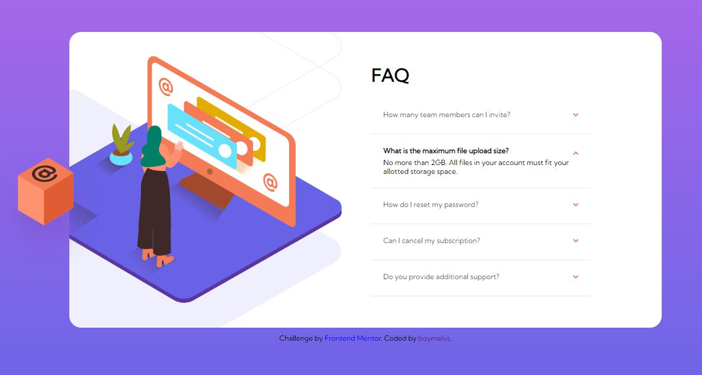

# Frontend Mentor - FAQ ACCORDION CARD SOLUTION PURE CSS

## Table of contents

- [Overview](#overview)
  - [The challenge](#the-challenge)
  - [Screenshot](#screenshot)
  - [Links](#links)
- [My process](#my-process)
  - [Built with](#built-with)
- [Author](#author)

## Welcome! 👋

Thanks for checking out this front-end coding challenge.

## Overview

This is a solution to the [FAQ accordion card challenge on Frontend Mentor](https://www.frontendmentor.io/challenges/faq-accordion-card-XlyjD0Oam). Using pure css.

### The challenge

Users should be able to:

- Design FAQ accordion card component
- View the optimal layout for the component depending on their device's screen size
- See hover states for all interactive elements on the page
- Hide/Show the answer to a question when the question is clicked

### Screenshot

### Links

- Solution URL: [My Solution](https://github.com/boymelvs/FAQ-ACCORDION-CARD-PURE-CSS.git)
- Live Site URL: [Live site](https://boymelvs.github.io/FAQ-ACCORDION-CARD-PURE-CSS/)

### Built with

- HTML
- Flexbox
- CSS

## Author

- Frontend Mentor - [Melvin](https://www.frontendmentor.io/profile/boymelvs)
